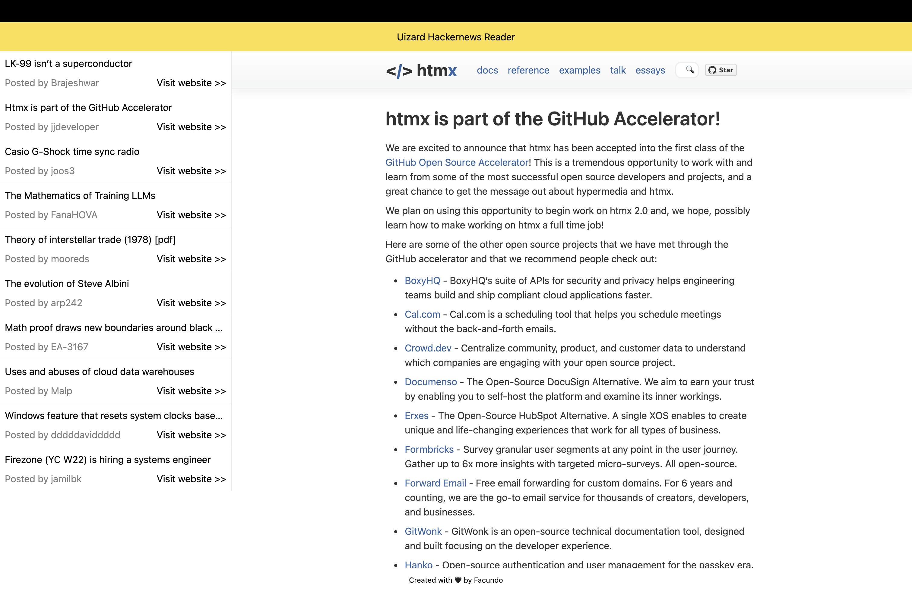

# Uizard Frontend Challenge

This challenge leverages is my best attempt to use the benefits of React Server Components implemented in Next.js framework.

The application is a HackerNews clone that highlights the top 10 stories using an <iframe/> component. It's important to note that due to browser security policies, some stories might not appear as expected.
## Deployment

This is the project running online [uizard-challenge-facuperezm.vercel.app/](https://uizard-challenge-facuperezm.vercel.app/).

To deploy this project on your machine do

```bash
  git clone https://github.com/facuperezm/uizard.git
```

```bash
  npm i
```
```bash
  npm run dev
```
or 
```bash
  npm run dev
```

## Tech Stack

**Client:** React, Next.js 13 using App Directory, TailwindCSS


## Optimizations

- [ ] Add testing to the project


## Screenshots

Take a look at the app in action:


## Author

This project was created by Facundo Perez Montalvo. Visit my portfolio at [facuperezm.com](https://facuperezm.com/) to learn more about me and my work.

[](https://facuperezm.com/)
[](https://www.linkedin.com/in/facuperezm/)
[](https://github.com/facuperezm) 

I hope you enjoy using this app as much as I enjoyed creating it!
